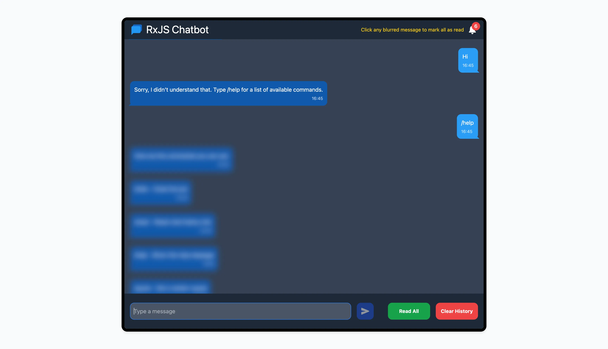

# RxJS React Chat

## Introduction

This project is a simple chatbot application built with **React**, **RxJS**, and **React Hooks** for
state management. It simulates a chatbot that responds based on pre-defined scripts. The application
uses **RxJS** to handle reactive data streams efficiently. Additionally, a custom UI library,
**[rxjs-chat-ui-lib](https://www.npmjs.com/package/rxjs-chat-ui-lib)**, is used for the components
and user interface.

To get started, install the custom UI library with:

```bash
npm install rxjs-chat-ui-lib

## What is RxJS?

RxJS (Reactive Extensions for JavaScript) is a library for reactive programming using Observables,
making it easier to compose asynchronous or callback-based code. It provides powerful tools for
managing event-based data streams efficiently.

### Key Concepts

- **Observable**: A data stream that can emit multiple values over time.
- **Observer**: A consumer that subscribes to an Observable to receive emitted values.
- **Subscription**: The mechanism that connects an Observer to an Observable.

## Features

- Real-time chat message updates using RxJS Observables.
- Components communicate through a shared RxJS stream.
- Efficient state management with React Hooks and RxJS.

## Screenshot



## Technologies Used


```
